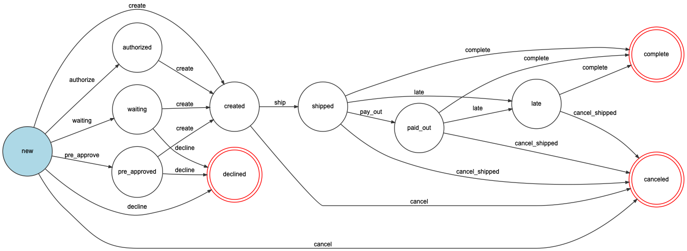

# Paella Core

The heart of Billie Pay-After-Delivery (PaD).

## Order State Workflow



## API Documentation

More info here:

https://ozean12.atlassian.net/wiki/spaces/PAELLA/pages/954173858/Paella+API#Documentation

## Maintenance Scripts
### Update Workflow Diagrams
Requirements: `graphviz`.

```bash
bin/generate-workflow-diagram
```

The generated images will be stored under the `docs` folder as PNG files.

### Update API Documentation
Requirements: `git`, `openapi-generator`.

You should run this command on your host, not inside the Docker container.
To get `openapi-generator`, run `brew install openapi-generator` first.

Usage:

```bash
bin/generate-api-docs [API_VERSION]
```

Generates all API specification variants at the same time (standard, dashboard, support, etc.).

The API_VERSION argument is optional, by default it uses the latest repository tag if possible,
or you can pass it manually. Examples:

```bash
# Automatic version (latest local tag + current commit hash)
bin/generate-api-docs
```

```bash
# Latest local tag + current commit hash (same as default)
bin/generate-api-docs $(git describe --tags 2> /dev/null)
```

```bash
# Latest local tag, without any commit hash
bin/generate-api-docs $(git describe --tags --abbrev=0 2> /dev/null)
```

```bash
# Manual
bin/generate-api-docs "2019.1.72"
```

The generated YAML files live under the `docs/openapi` folder.
