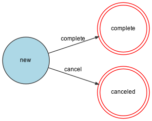

# Paella Core

The heart of Billie Pay-After-Delivery (PaD).

## Table of Contents

- [paella-core](#paella-core)
  * [Installation](#installation)
  * [Usage](#usage)
    + [API](#api)
    + [Makefile](#makefile)
    + [Docker helper script](#docker-helper-script)
  * [Testing](#testing)
    + [Running tests](#running-tests)
  * [Maintainers](#maintainers)
  * [Contributing](#contributing)


## Installation

In order to install this application for local development, 
first you need to make sure that you have access to the ozean12's 
[Docker registry](https://ozean12.atlassian.net/wiki/spaces/INFRA/pages/1109098718/Using+AWS+Docker+images+locally).
to pull PHP images.

Clone, initialize and start this application:

```
git clone git@github.com:ozean12/paella-core.git && \
cd paella-core && \
make
```

## State Workflows

> To update the diagrams, run the following (requires PHP and `graphviz`):
> ```bash
> bin/generate-workflow-diagram
> ```

### Orders Workflow (v1)


### Orders Workflow (v2)


### Merchant Onboarding Workflow



### Merchant Onboarding Step Workflow


## Usage

### API

The API documentation can be found as OpenAPI 3.0 YAML under [docs/openapi](docs/openapi)
or rendered as HTML navigating to the `/docs` HTTP route.

More info here:

https://ozean12.atlassian.net/wiki/spaces/PAELLA/pages/954173858/Paella+API#Documentation

### Makefile

You can use any target defined in the [docs/openapi](docs/openapi) with `make`, 
e.g. `make local-test-unit`.
Just be aware that the targets starting with `local-` will be executed
inside the Docker containers, while the others will be run directly on the machine, 
with the exception of `make test` (which is a shortcut for running all local tests).

### Docker helper script

You have a Docker Compose helper script under `bin/docker/app`. With that you are able to execute
any command available in your PHP docker image, e.g:

- `bin/docker/app composer install`
- `bin/docker/app bin/console list`
- `bin/docker/app php -v`

## Testing

Tests in this application use the 
[Testing Pyramid](https://github.com/ozean12/code-guidelines/blob/master/php/testing.md) principle.

### Running tests

Run all test suites in a fresh setup:

```bash
make test
```

Run all test suites (without setting up the containers again):

```bash
make local-test
```

Run a single test suite:

```bash
make local-test-unit
make local-test-integration
make local-test-functional
```

Run a single test file:

```bash
bin/docker/app vendor/bin/phpunit tests/Integration/FooTestCase.php
```

> TIP: running `make` will also recreate the application in a clean state.

## Contributing

This application follows 
[ozean12's PHP Coding Guidelines](https://github.com/ozean12/code-guidelines/tree/master/php)
and the
[Onion Architecture](https://github.com/ozean12/code-guidelines/blob/master/php/architectures/onion-architecture.md)
guidelines as well.
